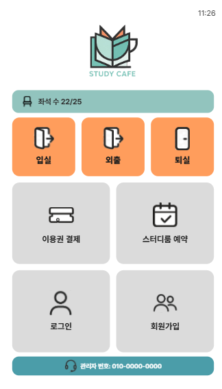
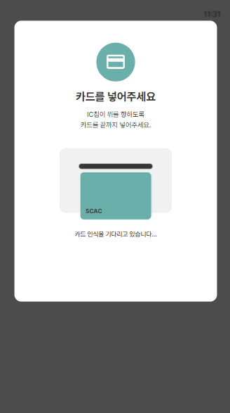
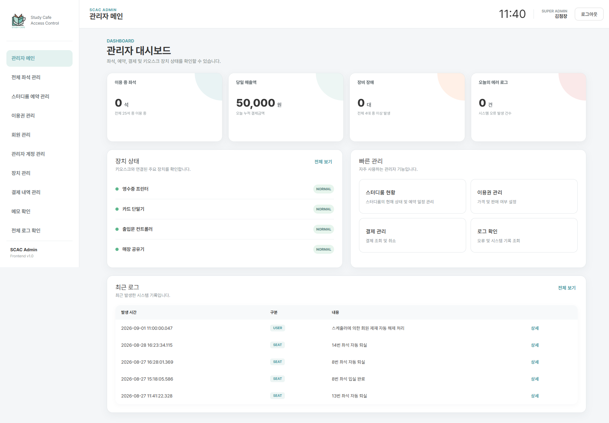
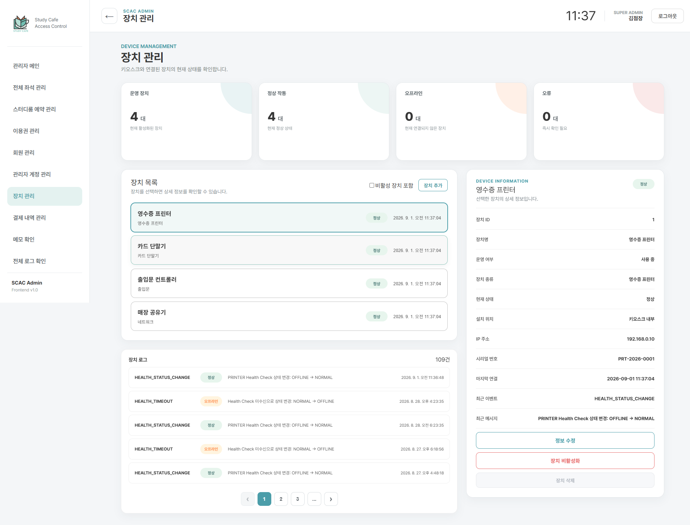

# ☕ SCAC

> **Study Cafe Access Control**
> 스터디카페 사용자 키오스크, 관리자 웹, Spring Boot Backend, RTOS 장치 연동을 하나의 서비스 흐름으로 구성한 풀스택 팀 프로젝트입니다.

---

## 📖 프로젝트 소개

SCAC는 스터디카페의 **회원/비회원 이용, 이용권 구매, 결제, 좌석 입·퇴실, 스터디룸 예약, 관리자 운영 및 장치 상태 관리**를 통합한 시스템입니다.

사용자용 키오스크와 관리자용 웹 서비스를 분리하되 하나의 Spring Boot Backend와 MySQL Database를 공유하며,
FreeRTOS POSIX 기반 RTOS Client를 연동하여 카드 리딩, 영수증 출력, 출입문 제어 및 장치 Health Check를 처리합니다.

```text
SCAC
├── scac-front    # 사용자용 Kiosk Frontend
├── scac-admin    # 관리자용 Web Frontend
├── scac-back     # Spring Boot REST API Server
├── scac-rtos     # FreeRTOS POSIX 기반 RTOS Client
└── docs          # 작업 기록 및 프로젝트 문서
```

---

## 🌐 Demo

사용자 키오스크 Frontend는 Vercel을 통해 확인할 수 있습니다.

- [SCAC Kiosk Live Demo](https://scac-liard.vercel.app)

> 결제, 인증 및 장치 제어 등 일부 기능은 Spring Boot Backend와 RTOS Client의 실행 상태에 따라 제한될 수 있습니다.

---

## 🖼 Screenshots

### 사용자 키오스크

| 메인 화면                                                                                        | RTOS 카드 결제                                                                                            |
| ------------------------------------------------------------------------------------------------ | --------------------------------------------------------------------------------------------------------- |
|  |  |
| 좌석 현황과 주요 서비스 선택                                                                     | 카드 리딩 명령 처리 대기                                                                                  |

### 관리자 대시보드



좌석 이용 현황, 당일 매출, 장치 상태 및 최근 시스템 로그를 통합 조회합니다.

### 관리자 장치 관리



RTOS Health Check를 기반으로 장치 상태, 마지막 연결 시각 및 장치별 로그를 확인합니다.

---

## 🎯 주요 목표

- 회원/비회원이 키오스크에서 스터디카페 서비스를 이용할 수 있는 사용자 흐름 구현
- 이용권 구매부터 결제, 발급, 좌석 이용까지 하나의 흐름으로 연결
- 좌석 이용권과 스터디룸 예약 결제를 하나의 Payment 도메인으로 관리
- 관리자 웹에서 회원, 좌석, 예약, 이용권, 결제, 장치, 로그, 메모를 통합 관리
- JWT 기반 사용자/관리자 인증 및 권한 분리
- JPA와 MyBatis를 역할에 맞게 함께 사용
- Toss Payments 및 CARD Mock 결제 지원
- SOLAPI 기반 인증번호 및 이용권 만료 예정 문자 발송
- Scheduler를 이용한 좌석, 예약, 장치, 제재 상태 자동 관리
- HTTP Polling 기반 Spring Boot ↔ RTOS 장치 명령 처리
- RTOS Health Check를 통한 장치 상태 모니터링

---

## ✨ 주요 기능

### 👤 사용자 / 인증

- 회원가입
- 비회원 등록
- 전화번호 기반 로그인
- JWT Access Token / Refresh Token 발급
- Access Token 재발급
- 사용자 / 관리자 인증 흐름 분리
- 입실 비밀번호 검증 및 변경
- SMS 인증번호 발송 및 검증
- 사용자 마이페이지

### 🎫 이용권

- 시간권 / 기간권 조회
- 이용권 선택 및 구매
- 결제 완료 시 `TicketUsage` 자동 발급
- 보유 이용권 조회
- 좌석 이용 가능 이용권 확인
- 관리자 이용권 등록 / 수정 / 삭제
- 판매 상태 관리

### 💳 결제

- 좌석 이용권 결제
- 스터디룸 예약 결제
- 서버 기준 금액 재검증
- CARD Mock 결제
- Toss Payments 간편결제
- 결제 성공 / 실패 처리
- 중복 승인 방지
- 결제 취소
- 결제 취소 시 이용권 또는 예약 상태 연동
- MyBatis View 기반 관리자 결제 이력 조회

### 💺 좌석 / 입·퇴실

- 전체 좌석 현황 조회
- 사용 중 좌석 조회
- 좌석 선택
- 입실
- 외출
- 외출 복귀
- 퇴실
- 시간권 잔여시간 1분 단위 차감
- 이용권 소진 시 다음 이용권 자동 전환
- 사용 가능한 이용권이 없을 경우 자동 퇴실
- 관리자 좌석 상태 변경
- 관리자 강제 퇴실
- 입·퇴실 시 RTOS 출입문 제어 명령 연동

### 🏢 스터디룸 예약

- 스터디룸 목록 및 상세 조회
- 날짜별 예약 가능 시간 조회
- 시작 / 종료 시간 선택
- 임시 예약 생성
- 예약 결제
- 결제 완료 후 `CONFIRMED` 처리
- 결제 대기 5분 초과 시 자동 취소
- 예약 시작 시 `IN_USE`
- 예약 종료 시 `COMPLETED`
- 사용자 예약 조회 / 취소
- 관리자 예약 조회 / 취소

### 🛠 관리자 시스템

- 관리자 대시보드
- 좌석 관리
- 스터디룸 예약 관리
- 이용권 관리
- 회원 검색 및 제재
- 결제 검색 / 필터 / 취소
- 장치 등록 / 수정 / 삭제
- 장치 활성화 / 비활성화
- 장치 상태 및 로그 조회
- 시스템 로그 조회
- 관리자 인수인계 메모 CRUD
- `SUPER_ADMIN` 전용 관리자 계정 관리

### 🖨 RTOS 장치 연동

- Spring Boot → RTOS 장치 명령 전달
- RTOS → Spring Boot 처리 결과 반환
- `CARD_READING` 카드 인식 시뮬레이션
- `PRINT_RECEIPT` 영수증 출력 시뮬레이션
- `DOOR_OPEN` 출입문 개방 및 자동 닫힘
- RTOS Command 1초 주기 Polling
- RTOS Health Check 5초 주기 전송
- 네트워크 / 카드리더기 / 프린터 / 도어 상태 전달
- 20초 이상 Health Check 미수신 시 장치 `OFFLINE` 처리

### 🔔 알림 / 자동화

- 회원가입 SMS 인증번호 발송
- 시간권 잔여 30분 이하 만료 예정 알림
- 기간권 24시간 이내 만료 예정 알림
- SOLAPI 발송 결과 동기화
- 동일 알림 중복 발송 방지
- 반복 실패 알림 최대 2회 제한
- 최대 실패 횟수 도달 시 `RETRY_EXHAUSTED` 처리
- 회원 제재 기간 만료 자동 해제
- 좌석 이용시간 자동 차감
- 예약 상태 자동 변경
- Health Check Timeout 장치 자동 OFFLINE 처리

---

## 🏗 System Architecture

```text
┌──────────────────────┐        ┌──────────────────────┐
│  SCAC Kiosk Frontend │        │  SCAC Admin Frontend │
│      scac-front      │        │      scac-admin      │
│  React / Zustand     │        │   React / Zustand    │
└──────────┬───────────┘        └──────────┬───────────┘
           │                               │
           │       REST API / JWT          │
           └──────────────┬────────────────┘
                          ▼
                ┌─────────────────────┐
                │      scac-back      │
                │    Spring Boot      │
                │   JPA + MyBatis     │
                │ JWT / Scheduling    │
                └───────┬─────┬───────┘
                        │     │
              ┌─────────┘     └────────────┐
              ▼                            ▼
         ┌─────────┐                ┌──────────────┐
         │  MySQL  │                │ External API │
         └─────────┘                │ Toss / SOLAPI│
                                    └──────────────┘

                Spring Boot
                     │
                     │ Device Command
                     ▼
              ┌─────────────┐
              │  scac-rtos  │
              │ FreeRTOS / C│
              └──────┬──────┘
                     │
          ┌──────────┼──────────┐
          ▼          ▼          ▼
    CARD_READING  RECEIPT   DOOR_OPEN
                     │
                     │ Health Check / Result
                     ▼
                Spring Boot
```

---

## 🛠 Tech Stack

| 영역           | 기술                                                                                                                |
| -------------- | ------------------------------------------------------------------------------------------------------------------- |
| Kiosk Frontend | React 19.2.7, React Router 7.18.1, Axios, Zustand, React Hook Form, Toss Payments SDK, QRCode React, CSS            |
| Admin Frontend | React 19.2.7, React Router 7.18.1, Axios, Zustand, CSS                                                              |
| Backend        | Java 21, Spring Boot 3.5.16, Spring Security, Spring Data JPA, MyBatis 3.0.5, Bean Validation, JJWT, Lombok, Gradle |
| Database       | MySQL                                                                                                               |
| External API   | Toss Payments, SOLAPI                                                                                               |
| RTOS           | C11, FreeRTOS POSIX Port, CMake, GCC, pthread                                                                       |
| Collaboration  | Git, GitHub, Figma, Postman, DBeaver                                                                                |

---

## 📂 Repository Structure

```text
SCAC
│
├── README.md
├── docs
│   ├── api
│   │   └── README.md
│   ├── architecture
│   │   └── README.md
│   ├── database
│   │   ├── README.md
│   │   └── erd.png
│   ├── meeting
│   ├── qa
│   │   └── README.md
│   ├── requirements
│   │   └── README.md
│   ├── scenarios
│   │   └── README.md
│   └── worklog
│
├── scac-front
│   ├── public
│   ├── src
│   ├── package.json
│   └── README.md
│
├── scac-admin
│   ├── public
│   ├── src
│   ├── package.json
│   └── README.md
│
├── scac-back
│   ├── src
│   ├── http
│   ├── build.gradle
│   └── README.md
│
└── scac-rtos
    ├── config
    ├── src
    ├── CMakeLists.txt
    └── Makefile
```

## 📚 Documentation

SCAC 프로젝트의 설계, 요구사항, 테스트 및 개발 과정은 다음 문서에서 확인할 수 있습니다.

| 문서                                                 | 설명                                     |
| ---------------------------------------------------- | ---------------------------------------- |
| [System Architecture](./docs/architecture/README.md) | 전체 시스템 구성과 컴포넌트 간 통신 구조 |
| [요구사항 명세서](./docs/requirements/README.md)     | 기능·비기능 요구사항 및 구현 상태        |
| [사용자 시나리오](./docs/scenarios/README.md)        | 사용자·관리자·RTOS 주요 이용 흐름        |
| [API 명세서](./docs/api/README.md)                   | 도메인별 REST API 요청 및 응답 명세      |
| [Database 설계서](./docs/database/README.md)         | ERD, 테이블 구조 및 주요 관계            |
| [QA 테스트 결과서](./docs/qa/README.md)              | 기능 테스트 결과와 결함 조치 내역        |
| [회의록](./docs/meeting/)                            | 프로젝트 회의 및 주요 의사결정 기록      |
| [작업일지](./docs/worklog/)                          | 팀원별 개발 진행 과정과 작업 기록        |

### 문서화 현황

- 요구사항 48건 정의 및 구현 상태 확인
- 사용자·관리자·장치 시나리오 22건 정리
- REST API 88개 명세
- Database 테이블 18개 및 View 1개 문서화
- QA 테스트 83건 수행 및 전체 통과
- 발견 결함 4건 수정 및 재검증 완료

---

## 🚀 Getting Started

> `spring.jpa.hibernate.ddl-auto=none`으로 설정되어 있으므로 애플리케이션 실행 전에 SCAC DB 스키마와 `vw_payment_history` View를 생성해야 합니다.

### 1. Backend

필수 환경:

- Java 21
- MySQL

`scac-back/.env` 예시:

```env
DB_URL=jdbc:mysql://localhost:3306/scac
DB_USERNAME=scac
DB_PASSWORD=your_password

JWT_SECRET=your_long_random_secret

TOSS_SECRET_KEY=test_sk_...

NOTIFICATION_ENABLED=false

SOLAPI_API_KEY=
SOLAPI_API_SECRET=
SOLAPI_SENDER_NUMBER=
```

실행:

```bash
cd scac-back
```

Windows:

```bash
./gradlew.bat bootRun
```

macOS / Linux:

```bash
./gradlew bootRun
```

Backend 기본 주소:

```text
http://localhost:8888
```

---

### 2. Kiosk Frontend

```bash
cd scac-front
npm install
npm start
```

`.env` 예시:

```env
PORT=3000
REACT_APP_API_URL=http://localhost:8888
REACT_APP_TOSS_CLIENT_KEY=test_ck_...
```

기본 개발 주소:

```text
http://localhost:3000
```

---

### 3. Admin Frontend

```bash
cd scac-admin
npm install
npm start
```

`.env` 예시:

```env
PORT=3001
REACT_APP_API_URL=http://localhost:8888
```

기본 개발 주소:

```text
http://localhost:3001
```

---

### 4. RTOS Client

`scac-rtos`는 Linux / Ubuntu 환경에서 FreeRTOS POSIX Port를 사용합니다.

필요 환경:

- Linux / Ubuntu
- GCC
- CMake
- Make
- FreeRTOS-Kernel

Ubuntu에서 필요한 빌드 도구 설치:

```bash
sudo apt update
sudo apt install -y cmake build-essential
```

빌드:

```bash
cd scac-rtos

cmake -S . -B build -DCMAKE_BUILD_TYPE=Debug
cmake --build build -j
```

Spring Boot와 RTOS를 같은 Linux 환경에서 실행하는 경우:

```bash
./build/day05_rtos http://localhost:8888
```

Spring Boot를 Windows에서 실행하고 RTOS를 WSL에서 실행하는 경우 Windows Host IP를 확인합니다.

```bash
WIN_HOST=$(ip route | awk '/default/ {print $3; exit}')
echo $WIN_HOST
```

RTOS 실행:

```bash
./build/day05_rtos http://$WIN_HOST:8888
```

Spring 연결 테스트:

```bash
curl -i http://$WIN_HOST:8888/api/commands/pending
```

---

## 🖨 RTOS Communication Flow

### Command

```text
React Kiosk
    │
    │ POST /api/commands
    ▼
Spring Boot
    │
    │ PENDING
    ▼
RTOS Client
    │
    │ 1초 주기 Polling
    ▼
Device Handler
    │
    ├── CARD_READING
    ├── PRINT_RECEIPT
    └── DOOR_OPEN
    │
    ▼
PATCH /api/commands/{id}/finish
    │
    ├── COMPLETED
    └── FAILED
    ▼
Spring Boot
```

### Health Check

```text
RTOS Client
    │
    │ 5초 주기
    ▼
POST /api/devices/health
    │
    ▼
Spring Boot
    │
    ├── NETWORK
    ├── DOOR
    ├── CARD_READER
    └── PRINTER
    │
    ▼
Device / DeviceLog
    │
    ▼
Admin Device Page
```

20초 이상 Health Check가 수신되지 않은 장치는 `OFFLINE`으로 변경합니다.

---

## 🔐 Authentication & Security

### User Role

```text
USER
GUEST
```

### Admin Role

```text
SUPER_ADMIN
STAFF
```

인증 정책:

- JWT 기반 Stateless 인증
- Access Token: 30분
- Refresh Token: 7일
- BCrypt 비밀번호 암호화
- 사용자 / 관리자 로그인 API 분리
- 사용자 Frontend Axios Interceptor에서 Access Token 자동 첨부
- 관리자 Frontend Axios Interceptor에서 Access Token 자동 첨부
- 401 발생 시 Refresh Token으로 Access Token 재발급
- 재발급 성공 시 기존 요청 자동 재시도
- `/api/admin/**`는 관리자 권한 필요
- `/api/admin/accounts/**`는 `SUPER_ADMIN` 전용
- Admin Frontend는 `AdminPrivateRoute` 적용
- 관리자 계정 페이지는 `SuperAdminRoute` 적용

---

## 📬 Common API Response

Backend의 공통 응답 객체는 `ApiResponse<T>`입니다.

```json
{
  "isSuccess": true,
  "message": "요청을 성공적으로 처리했습니다.",
  "data": {}
}
```

---

## 📌 Final Implementation Status

### 구현 완료

- 사용자·관리자 JWT 인증 및 Refresh Token 처리
- 좌석 이용권 및 스터디룸 예약 결제 통합
- 스터디룸 동시 예약 방지를 위한 비관적 락 적용
- 결제대기 예약 5분 초과 자동 취소
- RTOS 장치 명령 Polling 및 처리 결과 반환
- 장치 Health Check 및 OFFLINE 자동 전환
- SOLAPI 인증·만료 예정 알림 및 재시도 제한

### 기술적 한계 및 향후 개선

- 실제 장비 대신 FreeRTOS POSIX 환경에서 장치 동작 시뮬레이션
- 시연 환경에서는 CORS Origin 전체 허용
- 실제 운영 시 결제 이력 삭제보다 취소 중심 정책 필요

---

## 🔍 Key Engineering Challenges

### 스터디룸 결제 구조 재설계

초기 결제 구조는 `ticketId`를 필수 결제 대상으로 사용했으나,
스터디룸 정책이 시간당 요금 방식으로 확정되면서 예약 자체를 결제 대상으로 처리해야 했습니다.

이에 Payment가 `ticketId` 또는 `reservationId`를 결제 대상으로 받을 수 있도록 확장하고,
서버에서 예약 시간과 시간당 금액을 기준으로 결제금액을 재검증하도록 수정했습니다.
또한 예약 상태, 결제 취소, 이용 이력 및 관리자 결제 조회 구조를 함께 정비했습니다.

### 스터디룸 동시 예약 방지

동일 시간대의 예약 요청이 동시에 들어올 경우 중복 예약이 생성될 수 있어
MeetingRoom 조회에 비관적 락을 적용하고 트랜잭션 내부에서 예약 가능 여부를 다시 검증했습니다.

### RTOS 장치 상태 관리

RTOS Client가 5초마다 Health Check를 전송하고,
Backend가 20초 이상 통신이 없는 장치를 OFFLINE으로 전환하도록 구현했습니다.

---

## 👥 Team

> 아래 역할은 주요 담당 영역을 기준으로 작성했으며,
> 관리자 시스템과 도메인 간 통합 기능은 팀원 간 협업으로 구현했습니다.

| Name   | Role                                                                        |
| ------ | --------------------------------------------------------------------------- |
| 김수영 | 회원 · 인증 · 권한 · DB · 시스템 로그 · SMS 공통화                          |
| 장원진 | 좌석 · 입·퇴실 · 스터디룸 예약 · RTOS C Client · Git 및 배포                |
| 이지현 | 결제 · 이용권 · 관리자 주요 화면 · 장치관리 연동 · SOLAPI 알림 · 문서 및 QA |

---

## 📅 Development Period

**2026.07.03 ~ 2026.09.02**

---

## 📝 Documentation Version

**README v4.2**
**Last Updated: 2026.08.31**

### History

- README v1.0 — 2026.07.22
- README v1.1 — 2026.07.23
- README v2.0 — 2026.08.05
- README v2.1 — 2026.08.05
- README v3.0 — 2026.08.14
- README v4.0 — 2026.08.21
- README v4.1 — 2026.08.31
- README v4.2 — 2026.08.31
  - 프로젝트 문서 디렉터리 현행화
  - Architecture / Requirements / Scenarios 문서 추가
  - API / Database / QA 문서 연결
  - 회의록 및 작업일지 문서 연결

---

## 📄 Project Notice

본 프로젝트는 K-Digital Training 교육 및 팀 프로젝트 목적으로 제작되었습니다.
