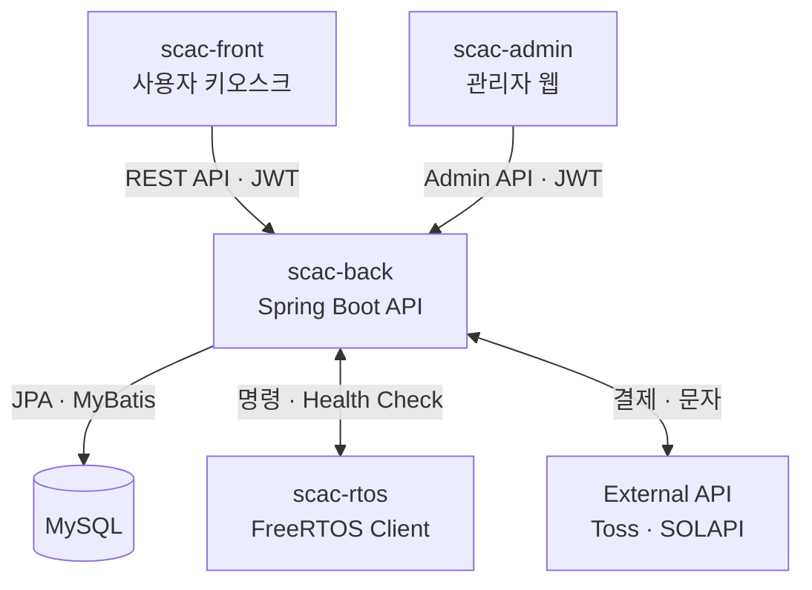
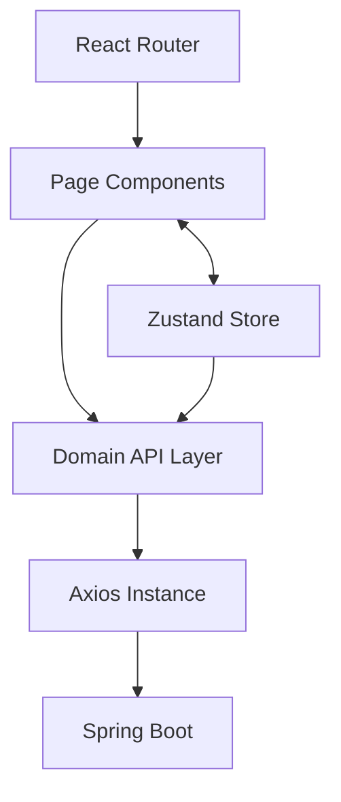
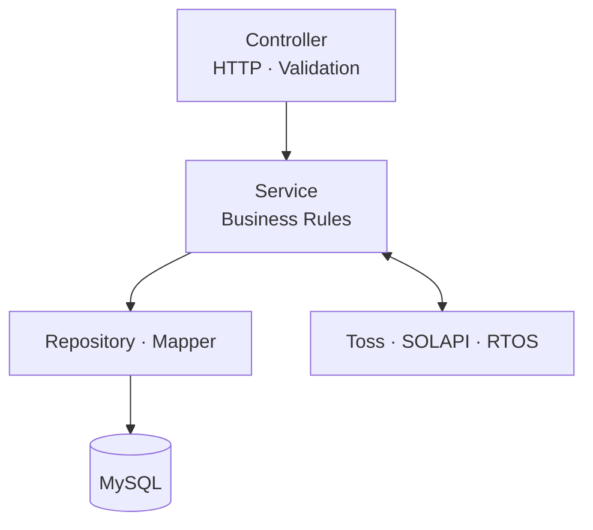
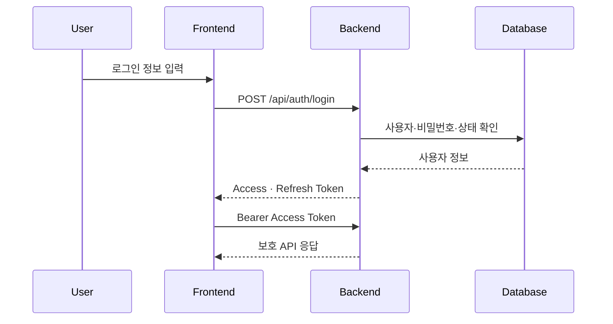
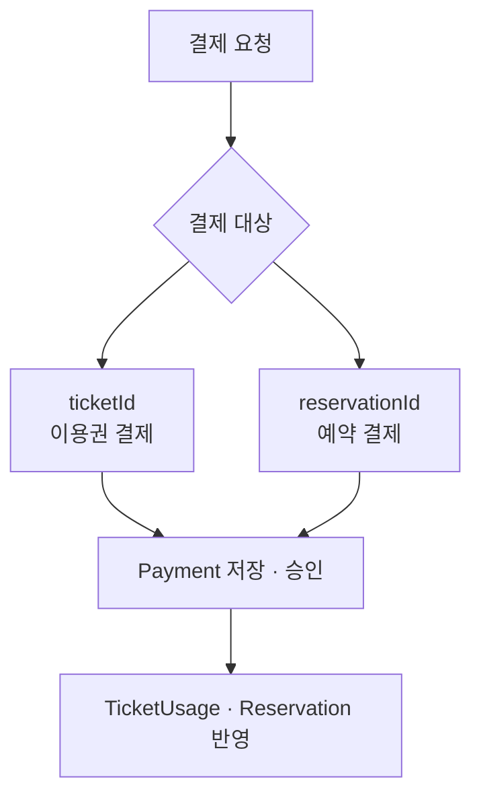
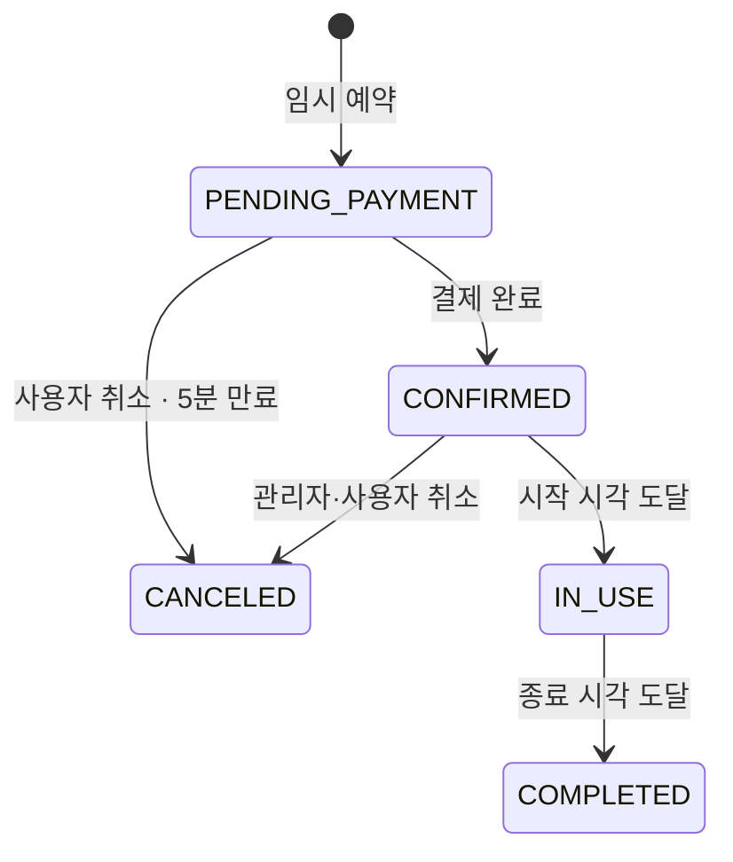
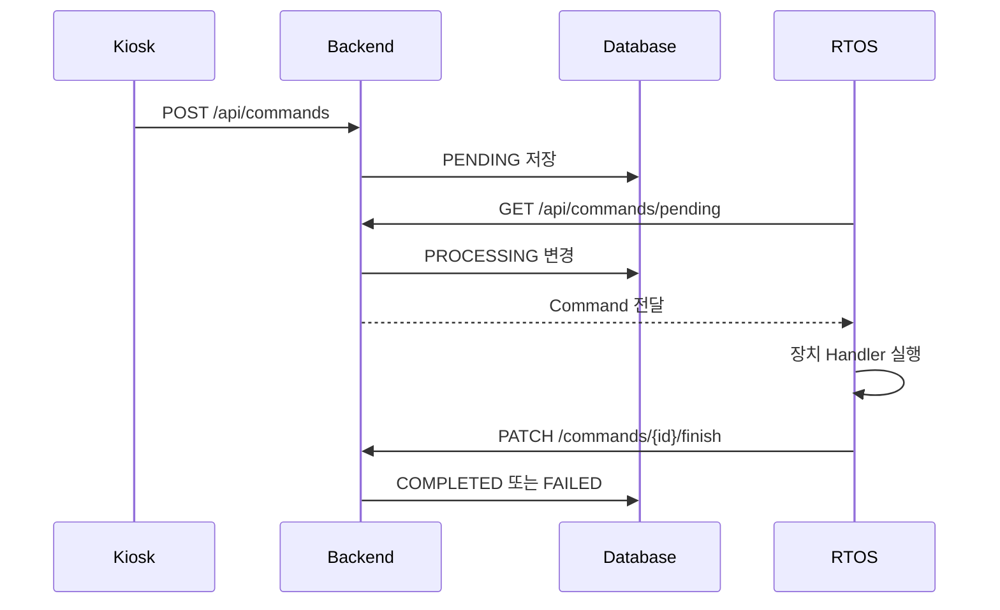
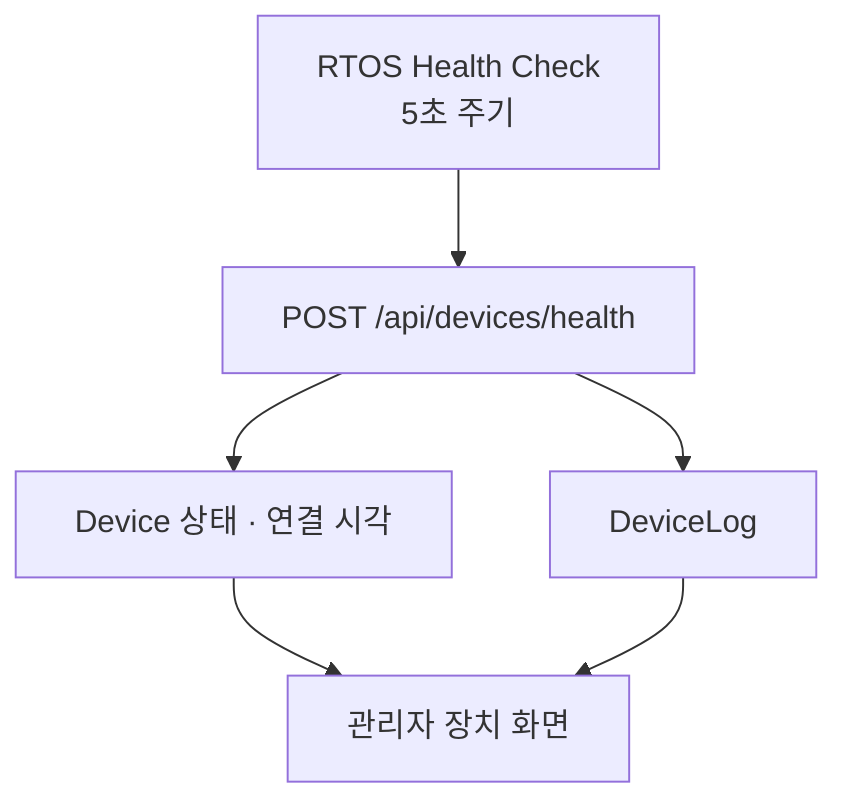

# SCAC System Architecture

> SCAC를 구성하는 사용자 키오스크, 관리자 웹, Backend, Database, RTOS Client 및 외부 서비스의 역할과 통신 구조를 정리한 문서입니다.

- Architecture Style: Client–Server, Layered Architecture
- Backend: REST API, Stateless JWT Authentication
- Device Communication: HTTP Polling, Health Check
- 기준 브랜치: `main`
- 최종 수정일: 2026-08-31

---

## 전체 시스템 구성



SCAC는 사용자와 관리자 Frontend를 분리하고 하나의 Backend와 Database를 공유합니다. 장치 동작은 Frontend가 직접 수행하지 않고 Backend를 거쳐 RTOS Client에 전달합니다.

---

## 컴포넌트별 역할

| Component     | Technology            | 역할                                                       |
| ------------- | --------------------- | ---------------------------------------------------------- |
| `scac-front`  | React, Zustand, Axios | 회원·비회원 키오스크, 결제, 좌석 이용, 스터디룸 예약       |
| `scac-admin`  | React, Zustand, Axios | 회원·좌석·예약·결제·이용권·장치·로그·메모 관리             |
| `scac-back`   | Java 21, Spring Boot  | 인증, 권한, 비즈니스 규칙, 상태 전이, Scheduler, 외부 연동 |
| MySQL         | MySQL                 | 사용자·결제·예약·이용권·장치·로그 영속화                   |
| `scac-rtos`   | C11, FreeRTOS POSIX   | 카드 리딩, 영수증 출력, 출입문 제어 시뮬레이션             |
| Toss Payments | External API          | 간편결제 승인·취소                                         |
| SOLAPI        | External API          | 인증번호 및 만료 예정 문자 발송                            |

### 책임 경계

```text
Frontend     사용자 입력, 화면 전환, 임시 UI 상태
Backend      인증, 권한, 금액, 소유권, 상태 전이 검증
Database     영속 데이터와 운영 이력 보존
RTOS         장치 명령 실행 및 상태 보고
External API 결제 승인과 문자 전송
```

클라이언트가 전달한 금액·권한·상태를 신뢰하지 않고 Backend가 영속 데이터에 근거하여 다시 검증합니다.

---

## Frontend Architecture

두 Frontend는 공통적으로 Page, Store, API Layer와 Axios Instance 구조를 사용합니다.



### 사용자 키오스크

- 키오스크 공통 Layout과 무입력 Timer
- 회원·비회원 인증 정보와 결제·좌석·예약 선택 상태 관리
- Axios Interceptor의 Access Token 첨부 및 재발급
- 오류 상황에서 `KioskErrorState`와 안내 Modal 제공
- 결제와 장치 명령 처리 결과 Polling

### 관리자 웹

- `AdminPrivateRoute`를 통한 관리자 인증 검사
- `SuperAdminRoute`를 통한 관리자 계정 페이지 제한
- 도메인별 Zustand Store와 API 모듈
- 목록·검색·필터·Summary·Pagination 공통 패턴
- 장치 상태 주기 조회와 오류 알림

---

## Backend Layered Architecture



| Layer          | 책임                                                           |
| -------------- | -------------------------------------------------------------- |
| Controller     | Endpoint, Request Validation, 인증 사용자 전달, 공통 응답 생성 |
| Service        | 금액·소유권·상태 전이·동시성 등 핵심 비즈니스 규칙             |
| Repository     | Spring Data JPA 기반 Entity 영속화와 조회                      |
| MyBatis Mapper | `vw_payment_history` 기반 관리자 결제 이력 조회                |
| Scheduler      | 이용권·예약·장치·제재·알림 상태 자동 관리                      |
| Global         | Security, JWT, Exception Handler, Logging, `ApiResponse`       |

---

## 인증 및 권한 구조

### 사용자 인증 흐름



Access Token이 만료되면 Frontend가 Refresh Token으로 재발급을 요청하고, 실패하면 인증 정보를 제거합니다.

### 권한 구분

| Actor                     | 권한                                         |
| ------------------------- | -------------------------------------------- |
| 회원 `USER`               | 본인의 결제·이용권·예약·좌석 이용 기능       |
| 비회원 `GUEST`            | 전화번호·입실 정보 기반 제한된 키오스크 기능 |
| 관리자 `STAFF`            | 일반 관리자 운영 기능                        |
| 최고 관리자 `SUPER_ADMIN` | 일반 운영 기능과 관리자 계정 관리            |

`/api/admin/accounts/**`는 `SUPER_ADMIN`만 접근할 수 있으며, Frontend Route 제한과 Backend Security를 함께 적용합니다.

---

## 결제 Architecture

SCAC의 Payment는 이용권과 스터디룸 예약을 하나의 결제 도메인에서 처리합니다.



### 설계 규칙

- `ticketId`, `reservationId` 중 정확히 하나만 허용합니다.
- 이용권 결제 금액은 `ticket_table.ticket_price`로 검증합니다.
- 예약 결제 금액은 예약 시간과 `meeting_room.hourly_rate`로 계산합니다.
- 결제 성공 시 이용권은 TicketUsage를 발급합니다.
- 예약 결제 성공 시 Payment와 MeetingRoomReservation을 연결합니다.
- 관리자 조회는 MyBatis와 `vw_payment_history`를 사용합니다.
- 중복 승인과 중복 발급을 방지합니다.

---

## 스터디룸 예약 Architecture



### 동시성 제어

동일한 방과 겹치는 시간대에 두 요청이 동시에 들어오는 상황을 방지하기 위해 다음 절차를 적용합니다.

1. Transaction을 시작합니다.
2. 대상 MeetingRoom을 비관적 락으로 조회합니다.
3. Transaction 내부에서 기존 예약과 시간 중복을 다시 검사합니다.
4. 가능한 경우에만 `PENDING_PAYMENT` 예약을 저장합니다.
5. 나중 요청은 예약 불가 오류로 거부합니다.

### 자동 상태 관리

- 5분 초과 미결제 예약 자동 취소
- 시작 시각 도달 시 `IN_USE`
- 종료 시각 도달 시 `COMPLETED`

---

## RTOS Command Architecture

Frontend가 장치를 직접 제어하지 않고 Backend에 명령을 생성합니다.



지원 명령:

| Command         | 장치 동작                |
| --------------- | ------------------------ |
| `CARD_READING`  | 카드 인식 시뮬레이션     |
| `PRINT_RECEIPT` | 결제 정보 영수증 출력    |
| `DOOR_OPEN`     | 출입문 개방 및 자동 닫힘 |
| `DOOR_CLOSE`    | 출입문 닫힘 처리         |

RTOS 명령은 `task_command` 테이블에 저장하며 `PENDING → PROCESSING → COMPLETED/FAILED` 상태로 관리합니다.

---

## Device Health Check Architecture



- RTOS는 Network, Door, Card Reader, Printer 상태를 전송합니다.
- Backend는 SCAC의 `NORMAL`, `ERROR`, `OFFLINE` 상태로 변환합니다.
- `last_connected_at`을 갱신합니다.
- 20초 이상 Health Check가 없으면 Offline Scheduler가 `OFFLINE`으로 변경합니다.
- 관리자 화면은 장치 상태와 DeviceLog를 주기적으로 다시 조회합니다.

---

## Database Architecture

데이터는 도메인별 Entity와 관계로 관리합니다.

| Domain      | 주요 저장소                                                 |
| ----------- | ----------------------------------------------------------- |
| 회원·인증   | `user`, `refresh_token`, `penalty_history`                  |
| 관리자      | `admin_account`, `admin_refresh_token`, `admin_memo`        |
| 좌석·입퇴실 | `seat`, `check_inout`                                       |
| 이용권      | `ticket_table`, `ticket_usage`                              |
| 예약·결제   | `meeting_room`, `meeting_room_reservation`, `payment_table` |
| 장치·RTOS   | `device`, `device_log`, `task_command`                      |
| 알림·로그   | `notification_log`, `system_log`                            |

일반 CRUD와 상태 변경에는 JPA를 사용하고, 여러 도메인의 조회 결과를 결합하는 관리자 결제 이력에는 MyBatis와 View를 사용합니다.

상세 관계는 [DB 설계서](../database/README.md)를 참고합니다.

---

## Scheduler Architecture

| Scheduler    | 역할                                             |
| ------------ | ------------------------------------------------ |
| TicketUsage  | 잔여시간 차감, 만료, 다음 이용권 전환, 자동 퇴실 |
| Reservation  | 미결제 예약 취소, 시작·종료 상태 변경            |
| Device       | Health Check Timeout 장치 `OFFLINE` 전환         |
| Penalty      | 제재 종료일 도달 시 상태 해제                    |
| Notification | 만료 예정 알림 발송, 실패 재시도 및 소진 처리    |

Scheduler는 처리 전에 현재 상태를 다시 검사하여 이미 완료·취소된 데이터를 중복 처리하지 않도록 구성합니다.

---

## 외부 서비스 연동

### Toss Payments

- Frontend에서 결제창 호출
- 성공 복귀 후 Backend 승인 API 호출
- Backend에서 금액과 결제 대상을 다시 검증
- 결제 승인·취소 결과를 Payment에 저장

### SOLAPI

- 휴대전화 인증번호 발송
- 이용권 만료 예정 문자 발송
- 결과와 실패 사유를 NotificationLog에 저장
- 최대 재시도 횟수 이후 `RETRY_EXHAUSTED` 처리

외부 서비스 실패가 이미 완료된 핵심 비즈니스 상태를 불필요하게 롤백하지 않도록 처리 흐름을 분리합니다.

---

## 공통 오류 처리 및 로깅

- Bean Validation을 통한 요청값 검증
- GlobalExceptionHandler를 통한 공통 오류 응답
- `ApiResponse<T>`의 `isSuccess`, `message`, `data` 구조
- 인증 실패 `401`, 권한 부족 `403`, 리소스 없음 `404`
- 예약 충돌과 상태 전이 오류 처리
- 사용자·관리자 주요 행위를 SystemLog에 기록
- 장치 상태·오류를 DeviceLog에 기록

---

## 주요 설계 결정

| 결정                        | 이유                                                          |
| --------------------------- | ------------------------------------------------------------- |
| 사용자·관리자 Frontend 분리 | 키오스크 UX와 운영 화면의 목적·권한 분리                      |
| 사용자·관리자 JWT 흐름 분리 | Token과 권한 경계 명확화                                      |
| 결제 대상 분기              | 이용권 상품과 시간당 예약 결제를 하나의 Payment로 관리        |
| JPA + MyBatis 병행          | 상태 변경은 Entity 중심, 복합 관리자 조회는 SQL 중심으로 처리 |
| 예약 비관적 락              | 동일 시간대 동시 예약의 데이터 중복 방지                      |
| Backend 경유 장치 명령      | Frontend와 장치 구현의 직접 결합 제거                         |
| Health Check                | 장치의 마지막 연결과 Offline 상태 판단                        |
| 로그 기반 장치 삭제 제한    | 운영 장애 및 상태 변경 이력 보존                              |

---

## 제한사항 및 향후 개선

- 실제 장비 대신 FreeRTOS POSIX 환경에서 장치 동작을 시뮬레이션합니다.
- 시연 환경에서는 CORS Origin을 실제 운영보다 넓게 허용할 수 있습니다.
- RTOS Command의 정상 API 상태 전이는 검증하지만, 완료된 DB 레코드를 운영자가 직접 `PENDING`으로 변경하는 비정상 상황의 멱등성은 향후 개선 대상입니다.
- 실제 운영 환경에서는 HTTPS, Secret Manager, 제한된 CORS와 장치 인증이 필요합니다.
- 대규모 트래픽을 대상으로 한 부하·장애 복구 테스트는 현재 범위에 포함하지 않습니다.

---

## 관련 문서

- [사용자 시나리오](../scenarios/README.md)
- [요구사항 정의서](../requirements/README.md)
- [API 명세서](../api/README.md)
- [DB 설계서](../database/README.md)
- [QA 테스트 결과서](../qa/README.md)
- [프로젝트 Root README](../../README.md)

---

본 문서는 SCAC 프로젝트의 최신 구현과 문서를 기준으로 작성되었습니다.
