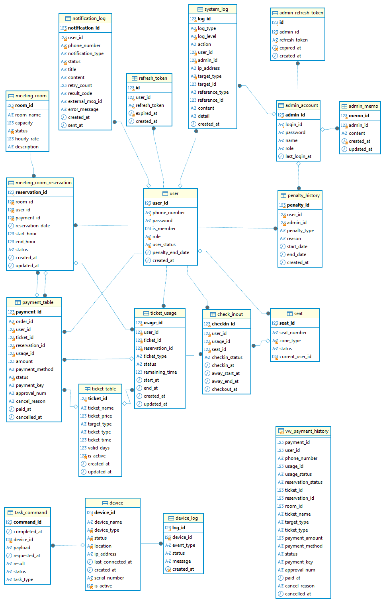

# SCAC Database 설계서

> SCAC 스터디카페 키오스크 시스템의 데이터베이스 구조와 핵심 설계 정책을 정리한 문서입니다.

- DBMS: MySQL
- 데이터 접근: Spring Data JPA, MyBatis
- 구성: 18개 테이블, 1개 조회 View
- 기준 브랜치: `main`
- 최종 수정일: 2026-08-31

---

## 목차

1. [ERD](#erd)
2. [도메인 구성](#도메인-구성)
3. [주요 테이블](#주요-테이블)
4. [핵심 관계](#핵심-관계)
5. [결제 대상 분기 구조](#결제-대상-분기-구조)
6. [스터디룸 예약과 결제](#스터디룸-예약과-결제)
7. [관리자 결제 이력 View](#관리자-결제-이력-view)
8. [RTOS 장치 관리](#rtos-장치-관리)
9. [알림과 시스템 로그](#알림과-시스템-로그)
10. [주요 상태값](#주요-상태값)
11. [설계 및 운영 참고사항](#설계-및-운영-참고사항)

---

## ERD



> `vw_payment_history`는 관리자 결제 이력 조회를 위해 결제, 회원, 이용권 및 스터디룸 예약 정보를 통합한 View입니다. 실제 테이블 간 FK 관계와 달리 View에는 별도의 관계선을 표시하지 않았습니다.

---

## 도메인 구성

| Domain      | Tables                                               | 역할                                            |
| ----------- | ---------------------------------------------------- | ----------------------------------------------- |
| 회원·인증   | `user`, `refresh_token`, `penalty_history`           | 회원 정보, 사용자 Refresh Token, 회원 제재 이력 |
| 관리자      | `admin_account`, `admin_refresh_token`, `admin_memo` | 관리자 계정·권한·인증 및 인수인계 메모          |
| 좌석·입퇴실 | `seat`, `check_inout`                                | 좌석 상태와 입실·외출·복귀·퇴실 기록            |
| 이용권      | `ticket_table`, `ticket_usage`                       | 판매 이용권 상품과 사용자의 이용권 사용 정보    |
| 스터디룸    | `meeting_room`, `meeting_room_reservation`           | 스터디룸 정보, 시간대별 예약 및 예약 상태       |
| 결제        | `payment_table`, `vw_payment_history`                | 이용권·스터디룸 결제와 관리자 결제 이력 조회    |
| 장치·RTOS   | `device`, `device_log`, `task_command`               | 장치 상태, Health Check 로그 및 RTOS 명령 처리  |
| 알림·로그   | `notification_log`, `system_log`                     | SMS 발송 결과와 사용자·관리자 시스템 행위 기록  |

---

## 주요 테이블

### 회원 및 인증

| Table             | PK           | 설명                                                       |
| ----------------- | ------------ | ---------------------------------------------------------- |
| `user`            | `user_id`    | 회원·비회원 기본 정보, 역할, 이용 상태 및 제재 종료일 관리 |
| `refresh_token`   | `id`         | 사용자 Refresh Token과 만료 시각 저장                      |
| `penalty_history` | `penalty_id` | 관리자가 적용한 이용 정지·영구 정지·제재 해제 이력 저장    |

`user.is_member`로 회원과 비회원을 구분하며, `user_status`와 `penalty_end_date`를 통해 현재 이용 가능 여부를 관리합니다.

### 관리자

| Table                 | PK         | 설명                                                  |
| --------------------- | ---------- | ----------------------------------------------------- |
| `admin_account`       | `admin_id` | 관리자 로그인 정보와 `STAFF`, `SUPER_ADMIN` 역할 관리 |
| `admin_refresh_token` | `id`       | 관리자 Refresh Token과 만료 시각 저장                 |
| `admin_memo`          | `memo_id`  | 관리자 간 인수인계 메모 저장                          |

관리자 계정 관리 기능은 `SUPER_ADMIN` 권한으로 제한하고, 일반 운영 기능은 `STAFF`와 `SUPER_ADMIN`이 사용합니다.

### 좌석 및 입퇴실

| Table         | PK            | 설명                                           |
| ------------- | ------------- | ---------------------------------------------- |
| `seat`        | `seat_id`     | 좌석 번호, 구역, 현재 상태 및 현재 사용자 관리 |
| `check_inout` | `checking_id` | 사용자의 좌석 입실·외출·복귀·퇴실 시간 기록    |

`check_inout`은 사용자, 사용 이용권과 좌석을 연결합니다. 입실 시 생성된 기록은 외출 및 복귀 시각을 갱신하고, 퇴실 시 `checkout_at`을 기록합니다.

### 이용권

| Table          | PK          | 설명                                               |
| -------------- | ----------- | -------------------------------------------------- |
| `ticket_table` | `ticket_id` | 시간권·기간권 등 판매 상품의 가격과 유효 조건 관리 |
| `ticket_usage` | `usage_id`  | 결제 후 발급된 이용권과 사용 상태·잔여 시간 관리   |

`ticket_table.target_type`으로 좌석과 스터디룸 대상을 구분하고, `ticket_type`, `ticket_time`, `valid_days`를 통해 이용권 정책을 표현합니다.

### 스터디룸

| Table                      | PK               | 설명                                               |
| -------------------------- | ---------------- | -------------------------------------------------- |
| `meeting_room`             | `room_id`        | 스터디룸 이름, 정원, 운영 상태 및 시간당 금액 관리 |
| `meeting_room_reservation` | `reservation_id` | 사용자, 예약 날짜·시간, 결제 및 예약 상태 관리     |

예약 시간은 `start_hour`, `end_hour`로 저장하며, 예약 생성 시 동일 스터디룸·날짜·시간대의 중복 예약을 방지합니다.

### 결제

| Table                | PK           | 설명                                                          |
| -------------------- | ------------ | ------------------------------------------------------------- |
| `payment_table`      | `payment_id` | 결제 주문, 대상, 금액, 결제수단, 승인 및 취소 정보 저장       |
| `vw_payment_history` | 조회용       | 관리자 결제 목록에 필요한 이용권·예약·사용자 정보를 통합 제공 |

`payment_table`은 `ticket_id` 또는 `reservation_id`를 사용하여 결제 대상을 구분합니다. 결제 승인 후 발급된 이용 정보가 있는 경우 `usage_id`로 연결합니다.

### 장치 및 RTOS

| Table          | PK           | 설명                                                   |
| -------------- | ------------ | ------------------------------------------------------ |
| `device`       | `device_id`  | 장치 유형, 상태, 위치, IP, 연결 시각 및 활성 여부 관리 |
| `device_log`   | `log_id`     | 장치별 상태 변경, Health Check 및 오류 메시지 기록     |
| `task_command` | `command_id` | Backend가 생성하고 RTOS가 처리하는 장치 명령 저장      |

### 알림 및 시스템 로그

| Table              | PK                | 설명                                                        |
| ------------------ | ----------------- | ----------------------------------------------------------- |
| `notification_log` | `notification_id` | SOLAPI SMS 요청, 처리 상태, 외부 메시지 ID와 실패 사유 저장 |
| `system_log`       | `log_id`          | 사용자·관리자 행위, 대상, 중요도 및 상세 내용 기록          |

---

## 핵심 관계

| Parent                     | Child                      | 관계 설명                          |
| -------------------------- | -------------------------- | ---------------------------------- |
| `user`                     | `refresh_token`            | 사용자 인증 갱신 정보              |
| `user`                     | `penalty_history`          | 사용자별 제재 이력                 |
| `user`                     | `notification_log`         | 사용자에게 발송한 알림 이력        |
| `user`                     | `payment_table`            | 사용자별 결제 주문                 |
| `user`                     | `ticket_usage`             | 사용자에게 발급된 이용권 사용 정보 |
| `user`                     | `meeting_room_reservation` | 사용자별 스터디룸 예약             |
| `user`                     | `check_inout`              | 사용자별 입퇴실 기록               |
| `user`                     | `seat`                     | 현재 좌석 이용자                   |
| `ticket_table`             | `payment_table`            | 이용권 상품 결제                   |
| `ticket_table`             | `ticket_usage`             | 발급된 이용권의 상품 정보          |
| `meeting_room`             | `meeting_room_reservation` | 스터디룸별 예약                    |
| `meeting_room_reservation` | `payment_table`            | 예약 건을 대상으로 한 결제         |
| `meeting_room_reservation` | `ticket_usage`             | 예약 결제 후 생성된 사용 정보      |
| `payment_table`            | `ticket_usage`             | 결제와 발급 이용 정보 연결         |
| `ticket_usage`             | `check_inout`              | 입실에 사용한 이용권 연결          |
| `seat`                     | `check_inout`              | 좌석별 입퇴실 기록                 |
| `admin_account`            | `admin_refresh_token`      | 관리자 인증 갱신 정보              |
| `admin_account`            | `admin_memo`               | 관리자 작성 메모                   |
| `admin_account`            | `penalty_history`          | 제재를 처리한 관리자               |
| `admin_account`            | `system_log`               | 관리자 행위 로그                   |
| `device`                   | `device_log`               | 장치별 상태·오류 로그              |
| `device`                   | `task_command`             | 장치별 RTOS 처리 명령              |

---

## 결제 대상 분기 구조

SCAC 결제는 하나의 `payment_table`에서 두 종류의 결제 대상을 관리합니다.

| 결제 대상     | 사용 FK          | 금액 산정 기준                         |
| ------------- | ---------------- | -------------------------------------- |
| 좌석 이용권   | `ticket_id`      | `ticket_table.ticket_price`            |
| 스터디룸 예약 | `reservation_id` | 예약 시간 × `meeting_room.hourly_rate` |

결제 생성 시 `ticket_id`와 `reservation_id` 중 정확히 하나만 사용합니다.

```text
Payment
├── ticket_id      → 좌석 이용권 결제
└── reservation_id → 스터디룸 예약 결제
```

두 값이 모두 없거나 동시에 존재하는 요청은 유효한 결제 대상으로 처리하지 않습니다.

이 구조를 통해 기존 이용권 결제 흐름을 유지하면서 스터디룸 예약 자체를 독립적인 결제 대상으로 지원합니다.

---

## 스터디룸 예약과 결제

스터디룸 예약은 결제 전 임시 예약부터 이용 완료까지 상태를 관리합니다.

```text
PENDING_PAYMENT → CONFIRMED → IN_USE → COMPLETED
        └────────────────────────────→ CANCELED
```

처리 흐름:

1. 사용자가 날짜와 시간을 선택하여 임시 예약을 생성합니다.
2. `meeting_room_reservation.status`를 `PENDING_PAYMENT`로 저장합니다.
3. 예약 건의 `reservation_id`를 결제 대상으로 사용합니다.
4. Backend가 예약 시간과 스터디룸 시간당 금액으로 결제 금액을 검증합니다.
5. 결제가 완료되면 예약과 결제를 연결하고 예약 상태를 확정합니다.
6. 예약 취소 시 연결된 결제도 함께 취소할 수 있습니다.

결제 전 임시 예약은 5분 동안만 유효하며, 시간 내 결제가 완료되지 않으면 취소 또는 만료 처리될 수 있습니다.

---

## 관리자 결제 이력 View

관리자 결제 목록은 MyBatis에서 `vw_payment_history`를 조회합니다.

View가 통합하는 주요 정보:

- 결제 및 주문 식별자
- 사용자 ID와 휴대전화 번호
- 이용권 사용 ID와 상태
- 예약 ID와 예약 상태
- 이용권 ID 또는 스터디룸 ID
- 상품명 또는 스터디룸명
- 결제 대상 및 이용권 유형
- 결제 금액과 결제수단
- 결제 상태와 승인 정보
- 결제 및 취소 시각·사유

이용권 결제와 스터디룸 결제를 하나의 관리자 목록에서 조회할 수 있도록 관련 값을 통합합니다.

```sql
SELECT *
FROM vw_payment_history
ORDER BY payment_id DESC;
```

> Backend 실행 환경에는 `vw_payment_history`가 미리 생성되어 있어야 합니다.

---

## RTOS 장치 관리

Backend와 RTOS Client는 `task_command`, `device`, `device_log`를 중심으로 연동합니다.

### 장치 명령

```text
Backend 명령 생성
        ↓
task_command.PENDING
        ↓
RTOS 명령 조회
        ↓
task_command.PROCESSING
        ↓
COMPLETED 또는 FAILED
```

지원하는 주요 명령:

- `CARD_READING`
- `PRINT_RECEIPT`
- `DOOR_OPEN`
- `DOOR_CLOSE`

### Health Check

RTOS Client는 일정 주기로 장치 상태를 Backend에 전달합니다.

- `device.last_connected_at`: 마지막 연결 시각
- `device.status`: 관리자 화면에 표시할 장치 상태
- `device_log`: 장치 상태 변경 및 오류 이력

Health Check가 일정 시간 동안 수신되지 않으면 Backend에서 장치를 `OFFLINE`으로 판단합니다.

---

## 알림과 시스템 로그

### SMS 알림

`notification_log`는 SOLAPI 연동 결과를 저장합니다.

주요 기록 정보:

- 수신 전화번호
- 알림 유형
- 제목과 메시지 내용
- 처리 상태 및 재시도 횟수
- 외부 메시지 ID와 결과 코드
- 실패 사유
- 생성·발송 시각

회원가입 인증번호 발송을 포함한 SMS 기능은 Backend의 통합 알림 서비스에서 처리합니다.

### 시스템 로그

`system_log`는 사용자와 관리자의 주요 행위를 기록합니다.

- 로그 유형과 중요도
- 수행 동작
- 사용자 또는 관리자 ID
- 요청 IP
- 대상 유형과 대상 ID
- 참조 유형과 참조 ID
- 로그 내용과 상세 정보

관리자 시스템 로그 화면에서 검색·필터·상세 조회에 사용됩니다.

---

## 주요 상태값

### 사용자 상태

사용 가능 여부, 이용 정지, 영구 정지 및 제재 종료일을 `user_status`, `penalty_end_date`와 제재 이력으로 관리합니다.

### 결제 상태

| Status     | 설명      |
| ---------- | --------- |
| `PENDING`  | 결제 대기 |
| `PAID`     | 결제 완료 |
| `CANCELED` | 결제 취소 |
| `FAILED`   | 결제 실패 |

### 예약 상태

| Status            | 설명                   |
| ----------------- | ---------------------- |
| `PENDING_PAYMENT` | 임시 예약 및 결제 대기 |
| `CONFIRMED`       | 결제 완료 및 예약 확정 |
| `IN_USE`          | 스터디룸 이용 중       |
| `COMPLETED`       | 이용 완료              |
| `CANCELED`        | 예약 취소              |

### 장치 상태

| Status    | 설명                                    |
| --------- | --------------------------------------- |
| `NORMAL`  | 정상                                    |
| `ERROR`   | 오류 또는 점검 필요                     |
| `OFFLINE` | 장치 연결 끊김 또는 Health Check 미수신 |

### 장치 명령 상태

| Status       | 설명           |
| ------------ | -------------- |
| `PENDING`    | RTOS 처리 대기 |
| `PROCESSING` | RTOS 처리 중   |
| `COMPLETED`  | 처리 성공      |
| `FAILED`     | 처리 실패      |

### 알림 상태

| Status            | 설명                     |
| ----------------- | ------------------------ |
| `PENDING`         | 발송 대기                |
| `SUCCESS`         | 발송 성공                |
| `FAILED`          | 발송 실패                |
| `RETRY_EXHAUSTED` | 최대 재시도 후 최종 실패 |

---

## 설계 및 운영 참고사항

- 데이터베이스의 시간 관련 컬럼은 Backend의 날짜·시간 정책과 일관되게 처리해야 합니다.
- 결제 금액은 클라이언트 값을 그대로 신뢰하지 않고 Backend에서 상품 또는 예약 정보와 비교합니다.
- 결제 내역은 이력 보존을 위해 물리 삭제보다 상태 기반 취소를 우선합니다.
- 장치 로그가 존재하는 장치는 운영 이력 보존 정책에 따라 삭제가 제한됩니다.
- 완료된 `task_command`의 상태를 임의로 `PENDING`으로 되돌리면 동일 장치 작업이 재실행될 수 있습니다.
- `vw_payment_history` 변경 시 MyBatis 조회 DTO 및 관리자 결제 화면 필드와 함께 검토해야 합니다.
- ERD는 관계와 주요 컬럼을 설명하며, 정확한 제약조건과 타입은 최신 MySQL Schema 및 Backend Entity를 기준으로 합니다.

---

## 관련 문서

- [API 명세서](../api/README.md)
- [Backend README](../../scac-back/README.md)
- [프로젝트 Root README](../../README.md)

---

본 문서는 SCAC 프로젝트의 최신 데이터베이스와 Backend 구현을 기준으로 작성되었습니다.
